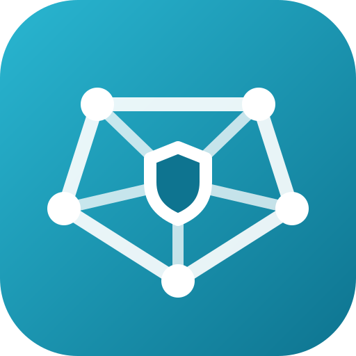
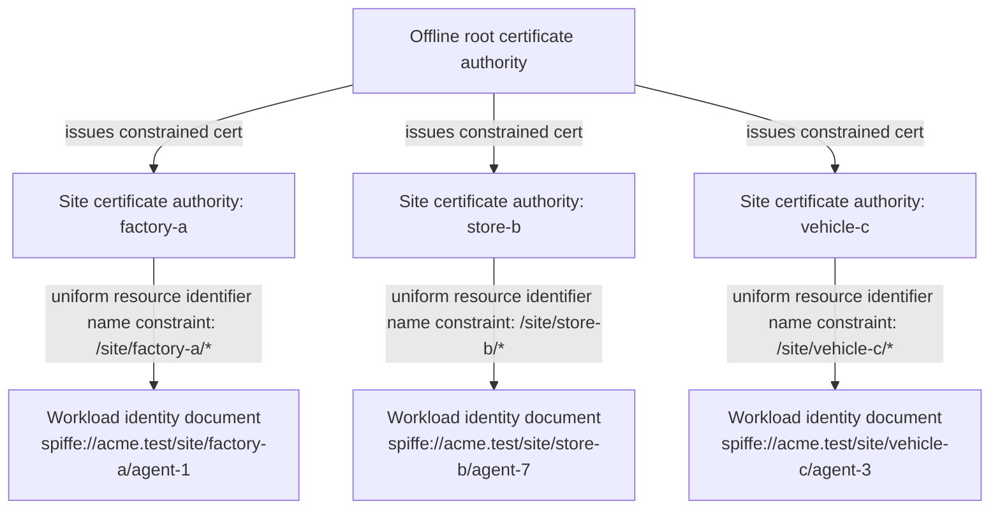
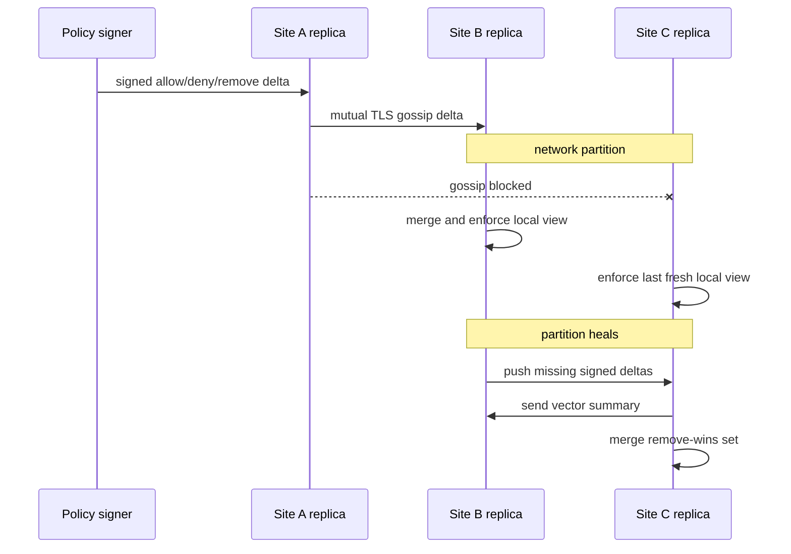
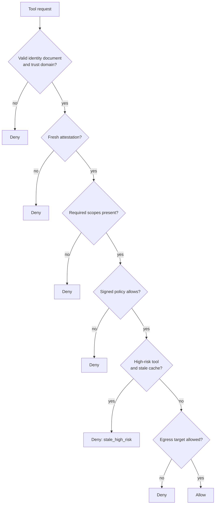

<p align="center"></p>

# Zero Trust Edge Agent Mesh

Zero Trust Edge Agent Mesh is a zero-trust Secure Production Identity Framework for Everyone (SPIFFE) mesh for artificial intelligence (AI) agents running at edge computing sites such as factories, stores, and vehicles. It keeps local identity, policy, and mutual TLS (mTLS) decisions working when a site is cut off from cloud services.

[](https://github.com/zero-trust-edge-agent-mesh/zero-trust-edge-agent-mesh/actions/workflows/ci.yml)
[](https://github.com/zero-trust-edge-agent-mesh/zero-trust-edge-agent-mesh/actions/workflows/formal.yml)
[](https://github.com/zero-trust-edge-agent-mesh/zero-trust-edge-agent-mesh/actions/workflows/codeql.yml)

## Why I built this

I wanted edge AI agents to keep making local authorization decisions during wide-area network (WAN) outages without falling back to static credentials or stale central policy. The design treats each edge site as a constrained trust island: it can issue short-lived workload SPIFFE Verifiable Identity Documents (SVIDs), exchange signed policy deltas with peers, and fail closed when local state is too old for a risky tool call.

The package is a Python reference implementation. It includes nested X.509 certificate authorities (CAs) with per-site name constraints, asyncio mTLS helpers, a signed delta conflict-free replicated data type (CRDT) policy store, a bounded-staleness policy decision point (PDP), a deterministic network simulator, and a Temporal Logic of Actions (TLA+) model for the policy merge rules.

## How it works

Each deployment has one offline root, one constrained intermediate certificate authority per site, and short-lived workload SVIDs for agents. Site intermediates can continue issuing SVIDs while disconnected, but validation still checks the SPIFFE trust domain, the site constraint, the certificate chain, and revocation state. Policy operations carry hybrid logical clocks; rules behave like an observed-remove set, and scalar metadata uses last-writer-wins ordering.



Policy changes are signed operations. Replicas merge them as a delta CRDT. Deny rules override allow rules, and remove-wins tombstones stop old grants from coming back after a partition heals.



A node decision is local. The policy decision point checks identity, attestation state, tool scope, signed policy, trust history, egress targets, and cache age. If a high-risk tool is requested after the configured staleness bound, the policy decision point denies even when the last policy view would allow it.



## Quickstart

Linux/macOS:

```bash
python -m venv .venv
. .venv/bin/activate
python -m pip install -e ".[dev]"
python -m pytest
bash scripts/check.sh
```

Windows PowerShell:

```powershell
python -m venv .venv
.\.venv\Scripts\python -m pip install -e ".[dev]"
.\.venv\Scripts\python -m pytest
```

Run the reference benchmark script after installing the shared benchmark package:

```bash
python -m pip install "zero-trust-agent-benchmark @ git+https://github.com/zero-trust-agent-benchmark/zero-trust-agent-benchmark@v0.1.0"
python -m bench.run_bench
```

## What I measured

Reference artifacts are committed under `results/20260926T064742Z-local/`. The run used Python 3.12 on Windows 11 ARM64 and Temporal Logic of Actions model checker (TLC). Wilson intervals use distinct benchmark traces. Latency tables use t confidence intervals for means and bootstrap confidence intervals for quantiles. The Zero Trust Agent Benchmark test split is dataset v4.1, `test.jsonl` sha256 `d065bab9bed145490579cd7add6a574c6e23c21c0ea4525dc1c14b0fc15acd2b`.

<!-- RESULTS_TABLE -->
| Metric | Result |
|---|---:|
| Artifact run | `results/benchmark-test/summary.json` |
| Zero Trust Agent Benchmark dataset | zero-trust-agent-benchmark-dataset-v4.1 (`test.jsonl` sha256 `d065bab9bed145490579cd7add6a574c6e23c21c0ea4525dc1c14b0fc15acd2b`) |
| Native tests and coverage | 125 passed, 5 skipped; 91% statement coverage |
| Dev split tuning result | block 87.2% [82.5%, 90.8%], false positive rate 1.6% [0.6%, 4.0%], leaks 0 |
| Test split final result | block 87.4% [84.2%, 90.0%], false positive rate 1.6% [0.8%, 3.1%], leaks 0 |
| Test split p95 decision latency | 8.750 ms (95% bootstrap confidence interval 8.123-9.618) |
| SPIFFE Verifiable Identity Document issue p95 | 5.788 ms (95% confidence interval 4.743-14.498) |
| Convergence p95 | 3.0 rounds (95% confidence interval 3.0-4.0) |
| TLA+ model checker | 145585 generated / 11024 distinct states, depth 10, 0 violations |

### Zero Trust Agent Benchmark v4.1 test split

The current sidecar adds raw secret egress detection, untrusted-origin delegation checks, and task-scope authority checks. It still uses only request-visible identity, context origin, task scope, tool metadata, allowed egress, trust history, signed policy, and issued-secret values supplied by the evaluator's vault hook. It does not read labels, families, trace or template identifiers, descriptions, split names, per-step malicious flags, or trace metadata.

Official evaluator results with `provide_issued_secrets=True`:

| Slice | Attack traces | Block rate (Wilson 95% confidence interval) | False positive rate (Wilson 95% confidence interval) | Leaks / leak rate (Wilson 95% confidence interval) |
|---|---:|---:|---:|---:|
| overall | 500 | 87.4% [84.2%, 90.0%] | 1.6% [0.8%, 3.1%] | 0 / 0.0% [0.0%, 0.4%] |
| in-policy | 250 | 76.4% [70.8%, 81.2%] | Not applicable | 0 / 0.0% [0.0%, 1.5%] |
| out-of-policy | 250 | 98.4% [96.0%, 99.4%] | Not applicable | 0 / 0.0% [0.0%, 1.5%] |

The same official evaluator run with `provide_issued_secrets=False` produced the same block rate, false-positive rate, and zero leaks, because the generic sidecar scanner also detects the benchmark's encoded and high-entropy secret forms.

Ablation on the test split:

| Version | Block rate | False positive rate | Leaks / leak rate | p95 latency ms |
|---|---:|---:|---:|---:|
| version 1: identity, scope, policy, egress allow-list, staleness | 48.8% [44.4%, 53.2%] | 0.8% [0.3%, 2.0%] | 50 / 5.0% [3.8%, 6.5%] | 42.457 [38.803, 45.265] |
| + secret-egress detection | 58.8% [54.4%, 63.0%] | 1.6% [0.8%, 3.1%] | 0 / 0.0% [0.0%, 0.4%] | 6.609 [6.330, 7.046] |
| + untrusted-origin delegation checks | 85.0% [81.6%, 87.9%] | 1.6% [0.8%, 3.1%] | 0 / 0.0% [0.0%, 0.4%] | 6.245 [5.944, 6.531] |
| final: task-scope authority checks | 87.4% [84.2%, 90.0%] | 1.6% [0.8%, 3.1%] | 0 / 0.0% [0.0%, 0.4%] | 6.337 [5.965, 6.821] |

Per-family test split:

| Family | Metric | Traces | Rate (Wilson 95% confidence interval) | Leaks / leak rate (Wilson 95% confidence interval) |
|---|---|---:|---:|---:|
| Benign development operations | false positive rate | 71 | 0/71 0.0% [0.0%, 5.1%] | 0 / 0.0% [0.0%, 5.1%] |
| Benign email | false positive rate | 72 | 0/72 0.0% [0.0%, 5.1%] | 0 / 0.0% [0.0%, 5.1%] |
| Benign files | false positive rate | 72 | 0/72 0.0% [0.0%, 5.1%] | 0 / 0.0% [0.0%, 5.1%] |
| Benign hard negative | false positive rate | 71 | 8/71 11.3% [5.8%, 20.7%] | 0 / 0.0% [0.0%, 5.1%] |
| Benign Model Context Protocol | false positive rate | 71 | 0/71 0.0% [0.0%, 5.1%] | 0 / 0.0% [0.0%, 5.1%] |
| Benign research | false positive rate | 72 | 0/72 0.0% [0.0%, 5.1%] | 0 / 0.0% [0.0%, 5.1%] |
| Benign secrets | false positive rate | 71 | 0/71 0.0% [0.0%, 5.1%] | 0 / 0.0% [0.0%, 5.1%] |
| Control token | block | 60 | 57/60 95.0% [86.3%, 98.3%] | 0 / 0.0% [0.0%, 6.0%] |
| Data exfiltration | block | 100 | 100/100 100.0% [96.3%, 100.0%] | 0 / 0.0% [0.0%, 3.7%] |
| Parser confusion | block | 40 | 24/40 60.0% [44.6%, 73.7%] | 0 / 0.0% [0.0%, 8.8%] |
| Privilege escalation | block | 90 | 87/90 96.7% [90.7%, 98.9%] | 0 / 0.0% [0.0%, 4.1%] |
| Prompt injection | block | 90 | 81/90 90.0% [82.1%, 94.6%] | 0 / 0.0% [0.0%, 4.1%] |
| Tool hijack | block | 60 | 37/60 61.7% [49.0%, 72.9%] | 0 / 0.0% [0.0%, 6.0%] |
| Tool poisoning | block | 60 | 51/60 85.0% [73.9%, 91.9%] | 0 / 0.0% [0.0%, 6.0%] |

## Limitations

A mesh is best suited to stopping identity failures, missing authorization, egress violations, secret egress, stale policy, and authority amplification across delegation. It can also block request-level tool use when untrusted content asks for authority the requester did not have. Pure parser ambiguity and tool-hijack cases that remain inside the allowed identity, task, tool, and egress envelope are not fully stopped by this mesh-only design.

## License

Apache-2.0. See `LICENSE`. For software citation metadata, see `CITATION.cff`.
